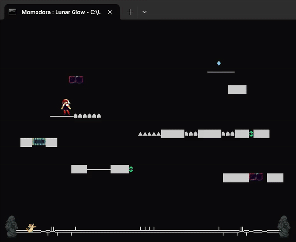
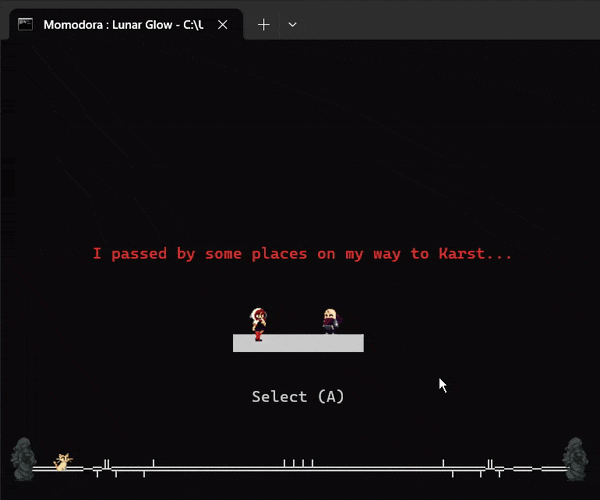
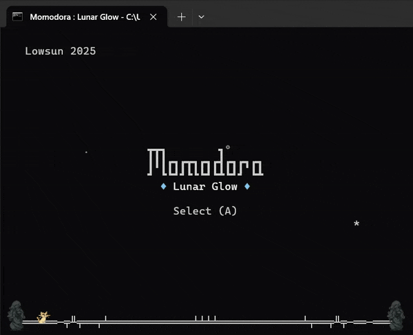

# Momodora : Lunar Glow

I really enjoyed playing the Momodora series, so here is  a short & sweet fangame in the form of a puzzle platformer. It's more of a technical demo if anything, using Windows Terminal's new Sixel functionality, and only using Batch Script (with a bit of Powershell and Jscript).  It takes place after Kaho meets Cath in Karst City.

## Features

* 7 levels of platforming puzzles

* Unique ASCII + Sixel graphic style

* Various traps / interactables

* Soundtrack and dialogue

* Scripting Languages only

## Gameplay




## How to Play
Download the latest release [here](https://github.com/thelowsunoverthemoon/momodoralunarglow/releases/latest). Simply double click ```game.bat``` (if Terminal is the default) or go on Terminal, ```CD``` into the directory, and type ```game```. This game is meant to be played on the default Terminal settings for CMD, and it includes audio, so turn up the volume. This game in Windows only, on the latest version of Windows Terminal (1.22). You can check your version by running wt --version. To download the latest version, go [here](https://github.com/microsoft/terminal/releases/latest).

## How it Works

With the new sixel functionality, we can create Sixel sprites to complement ASCII graphics. To read .sixel files, just use ```FOR /F```. However, Batch Script has a variable / line limit that limits the amount of sprites to display on the screen. To overcome this, one can start a separate thread (```RENDER_PROPS```), used here to show a border. I use Powershell for non-blocking input instead of the conventional Batch method to allow multiple key detection at a time. Furthermore, I use JScript for audio by embedding it inside the file.
